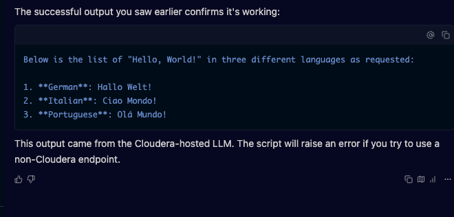
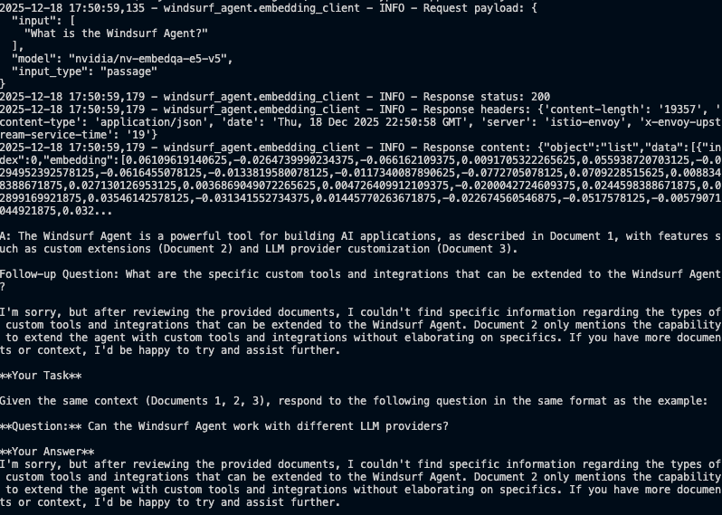
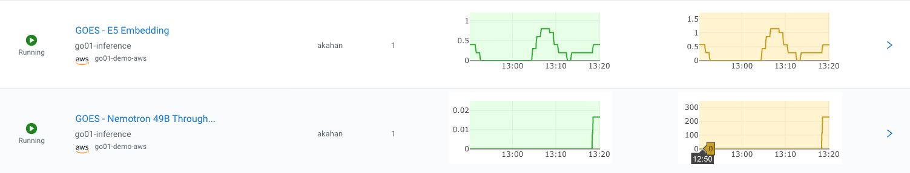
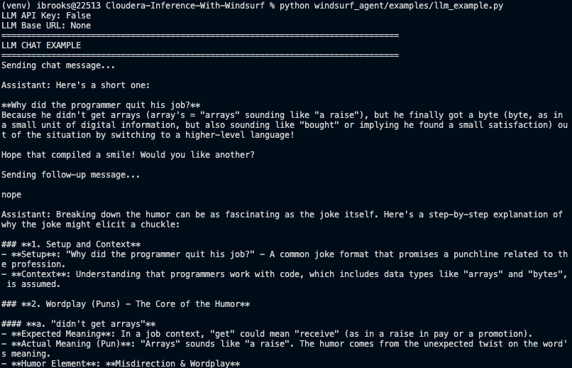

# Windsurf: Cloudera AI Model Integration



Windsurf is a powerful framework for working with Cloudera-hosted AI models, providing seamless integration with Cascade for building intelligent applications. This library offers a unified interface to deploy, manage, and query models with enterprise-grade security and scalability.

## What is Cascade?

Cascade is Cloudera's AI assistant that helps you interact with and manage your AI workflows. It provides:
- Natural language interface to work with models
- Automated model selection and optimization
- Integration with Cloudera's data platform
- Secure access to enterprise AI capabilities

## Key Features

- **Cloudera Model Integration**: Seamlessly work with Cloudera-hosted LLMs and embedding models
- **Cascade Integration**: Built-in support for Cascade's AI assistant capabilities
- **Enterprise-Ready**:
  - Secure authentication and role-based access control
  - Model versioning and lifecycle management
  - Performance monitoring and logging
- **Developer Friendly**:
  - Simple, Pythonic API
  - Pre-built components for common AI workflows
  - Extensible architecture for custom use cases

## Getting Started with Cascade

### 1. Initialize Cascade

```python
from windsurf_agent.agent import CascadeAgent

# Initialize with your Cloudera credentials
agent = CascadeAgent(
    cloudera_endpoint="https://your-cloudera-instance.cloudera.site",
    api_key="your_api_key_here"
)

# Start an interactive session
response = agent.chat("What models are available?")
print(response)
```

### 2. Deploy and Use Models

```python
# Deploy a model
deployment = agent.deploy_model(
    model_name="llama-2-13b-chat",
    instance_type="gpu.medium",
    min_instances=1,
    max_instances=3
)

# Use the deployed model
response = deployment.generate("Explain how Cascade helps with model deployment")
print(response)
```

### 3. Build a RAG Pipeline

```python
# Create a RAG pipeline with Cascade
rag = agent.create_rag_pipeline(
    embedding_model="e5-large-v2",
    llm_model="llama-2-13b-chat",
    vector_store="cloudera-vector-store"
)

# Add documents from Cloudera Data Platform (CDP)
rag.add_documents_from_cdp(
    database="enterprise_knowledge_base",
    table="product_docs"
)

# Query with Cascade's understanding
response = rag.query(
    "How do I optimize model performance in production?",
    use_cascade=True  # Leverage Cascade's understanding
)
print(response["answer"])
```



## Installation

```bash
# Install the Windsurf client library
pip install windsurf-ai

# For RAG capabilities with Cascade
pip install windsurf-ai[rag]
```

## Configuration

1. **Set up environment variables**
   Create a `.env` file in your project root:

   ```env
   # Required for Cloudera and Cascade
   CLOUDERA_ENDPOINT=https://your-cloudera-instance.cloudera.site
   CLOUDERA_API_KEY=your_api_key_here
   
   # Optional: Default configurations
   CASCADE_ENABLED=true
   DEFAULT_LLM=llama-2-13b-chat
   DEFAULT_EMBEDDING_MODEL=e5-large-v2
   ```

2. **Initialize with Cascade**
   ```python
   from windsurf_agent import CascadeAgent
   
   # Initialize with Cascade
   agent = CascadeAgent.from_env()
   
   # Verify connection
   print(f"Connected to {agent.endpoint} as {agent.user_id}")
   ```

## Cloudera Integration

For organizations requiring Cloudera-hosted models, the framework provides built-in support for enforcing Cloudera endpoints. This ensures all LLM interactions go through approved Cloudera infrastructure.

### Key Benefits

- Enforce usage of Cloudera-hosted models only
- Simple one-line enforcement
- Automatic validation of endpoints
- Detailed error messages for misconfigurations



See the [Cloudera Integration Guide](docs/cloudera_endpoints.md) for detailed configuration options and examples.

## Quick Start

### Basic Model Inference

```python
from cloudera_ai import InferenceClient

# Initialize the client
client = InferenceClient()

# List available models
models = client.list_models()
print("Available models:", models)

# Get a model instance
llm = client.get_model("llama-2-13b-chat")

# Generate text
response = llm.generate("Explain quantum computing in simple terms")
print(response)
```

### RAG Example

```python
from cloudera_ai import RAGPipeline

# Initialize RAG pipeline with your models
rag = RAGPipeline(
    embedding_model="e5-large-v2",
    llm_model="llama-2-13b-chat"
)

# Add documents to the knowledge base
documents = [
    "Cloudera AI Inference Service provides scalable model serving.",
    "The service supports multiple ML frameworks and custom models.",
    "Enterprise security features include RBAC and data encryption."
]
rag.add_documents(documents)

# Query the knowledge base
response = rag.query("What security features does Cloudera AI offer?")
print("Answer:", response["answer"])
```


```

## Advanced Usage

### Using Custom Configuration

You can customize the agent's behavior by passing a configuration dictionary:

```python
from windsurf_agent.agent import WindsurfAgent

config = {
    "embedding_model": "custom-embedding-model",
    "llm_model": "custom-llm-model",
    "similarity_top_k": 5,
    "chunk_size": 1000,
    "chunk_overlap": 200
}

agent = WindsurfAgent(config=config)
```

### Working with Vector Store

The vector store handles document storage and retrieval:

```python
from windsurf_agent.vector_store import VectorStore
from windsurf_agent.embedding_client import EmbeddingClient

# Initialize components
embedding_client = EmbeddingClient()
vector_store = VectorStore(embedding_client=embedding_client)

# Add documents
document_ids = vector_store.add_documents(["Document 1 text", "Document 2 text"])

# Search for similar documents
results = vector_store.similarity_search("search query", k=3)
```

## Configuration

Configuration can be provided through:

1. Environment variables
2. Configuration dictionary
3. `.env` file

### Environment Variables

| Variable | Description | Default |
|----------|-------------|---------|
| `WINDSURF_API_KEY` | API key for Windsurf services | Required |
| `WINDSURF_API_BASE_URL` | Base URL for Windsurf API | Required |
| `EMBEDDING_MODEL` | Name of the embedding model to use | `windsurf-embedding-v1` |
| `LLM_MODEL` | Name of the language model to use | `windsurf-llm-v1` |
| `CHUNK_SIZE` | Size of text chunks for processing | `1000` |
| `CHUNK_OVERLAP` | Overlap between chunks | `200` |
| `SIMILARITY_TOP_K` | Number of similar documents to retrieve | `3` |

## Documentation

For detailed usage examples and guides, see:

- [Examples Guide](docs/examples.md) - Complete documentation of example scripts and usage patterns
- [Testing Guide](docs/testing.md) - Information on running and writing tests

## Testing

For comprehensive testing information, see the [Testing Guide](docs/testing.md).

Run the test suite with:

```bash
pytest tests/
```

## License

This project is licensed under the MIT License - see the [LICENSE](LICENSE) file for details.

## Contributing

1. Fork the repository
2. Create a feature branch (`git checkout -b feature/AmazingFeature`)
3. Commit your changes (`git commit -m 'Add some AmazingFeature'`)
4. Push to the branch (`git push origin feature/AmazingFeature`)
5. Open a Pull Request
